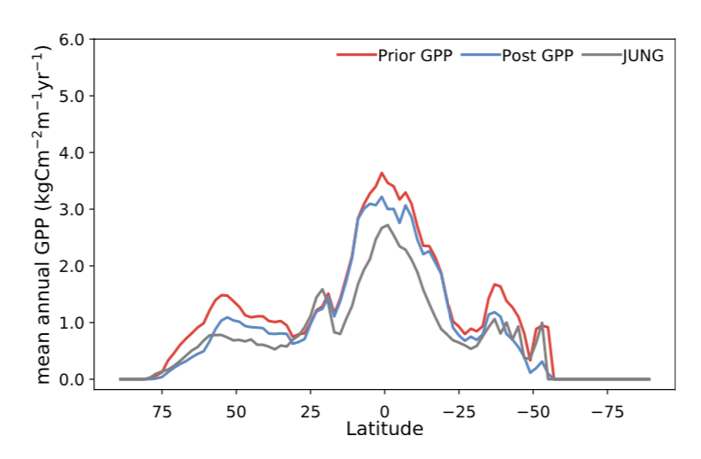

# Exercise 9: Introduction to CartoPy for plotting maps with geospatial coordinates

In today's class we're going to learn about the CartoPy Python library for plotting maps with geospatial coordinates (i.e. with latitudes and longitudes). Follow the notes in the powerpoint in the Exercise 9 folder.

## In-class exercise
We'll use what we have learned previously about reading data from NetCDF files and what we've learned today to perform visual analyses comparing the GPP dataset we used in the last class to satellite measurements of solar induced chlorophyll fluorescence (SIF). SIF is a byproduct of photosynthesis; therefore, it should be a good proxy for GPP.  

The SIF data were collected from the GOME-2 satellite: https://www.eumetsat.int/website/home/Satellites/CurrentSatellites/Metop/MetopDesign/GOME2/index.html.

The SIF data are in a different netcdf file called gome2_sif_monthly_2007-2011.nc. They have the same spatial and temporal resolution.

In our analysis we will use the SIF to evaluate if the model contains an accurate representation of photosynthesis processes. 

Our in-class exercise today is to complete the following in a Jupyter Notebook (with comments for each task!):  
* Follow what we have learned in class over the past week or two to read in the GPP and SIF data and plot both datasets on two separate Cartopy maps with geospatial latitude and longitude coordinates on the x and y axes of the plot.
* Write the logic (step-by-step) of the script you plan to write at the top in a markdown box
* Then, answer the following questions in your Jupyter Notebook:
*1. Do the spatial distributions of the mean GPP and mean SIF look similar, even though the range of each data is not the same?*
*2. In which region is plant productivity the highest (give latitude and longitude information)? Is this what we may expect?*

### EXTRA if you're familiar with Python or programming:
* Create a latitudinal plot to compare the latitudinal distributions of GPP and SIF. 
* For that you will need to sum all the data for each latitude (i.e. sum all the data for each row).
* The final product should look something like this (but with different data plotted):

**That's it, you're finished! Upload your jupyter notebook to Canvas by the start of next class.**
